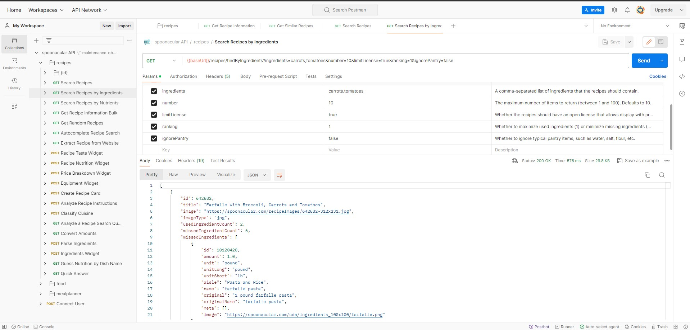
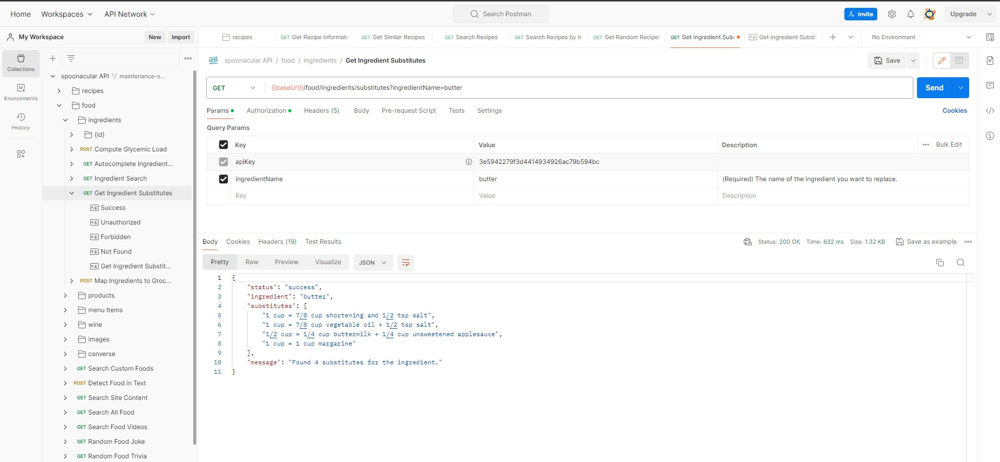
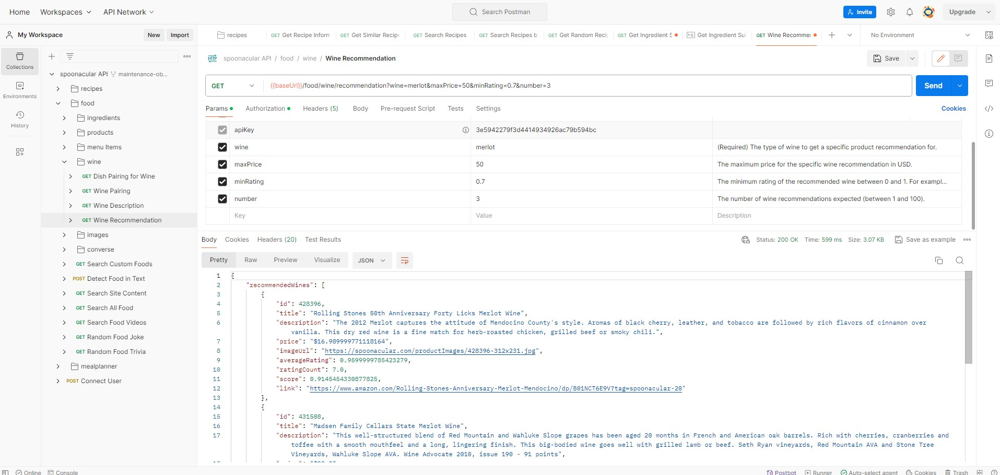

# Практическая работа. Урок 1. Основы клиент-серверного взаимодействия. Парсинг API

## Задание

1. Ознакомиться с некоторые интересными API. https://docs.ozon.ru/api/seller/ https://developers.google.com/youtube/v3/getting-started https://spoonacular.com/food-api
2. Потренируйтесь делать запросы к API. Выберите публичный API, который вас интересует, и потренируйтесь делать API-запросы с помощью Postman. Поэкспериментируйте с различными типами запросов и попробуйте получить различные типы данных.
3. Сценарий Foursquare
4. Напишите сценарий на языке Python, который предложит пользователю ввести интересующую его категорию (например, кофейни, музеи, парки и т.д.).
5. Используйте API Foursquare для поиска заведений в указанной категории.
6. Получите название заведения, его адрес и рейтинг для каждого из них.
7. Скрипт должен вывести название и адрес и рейтинг каждого заведения в консоль.

### Решение

1. Для теста выбрано API https://spoonacular.com/food-api 

2. Несколько выполненных запросов в Postman:

- поиск рецептов по ингредиентам:

- поиск рецепта по названию и по ингредиентам:

- рекомендованное вино:

3. 3-7 задания: https://ya.ru
